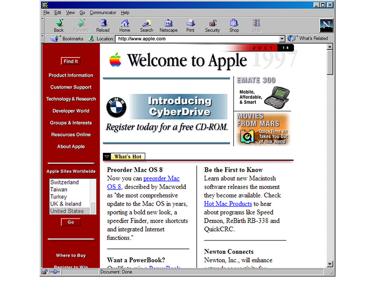
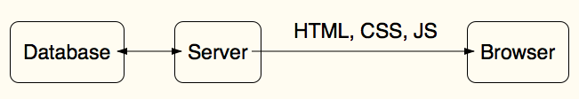
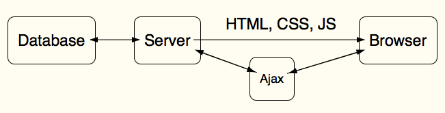
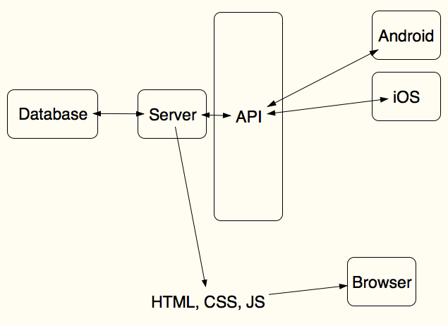
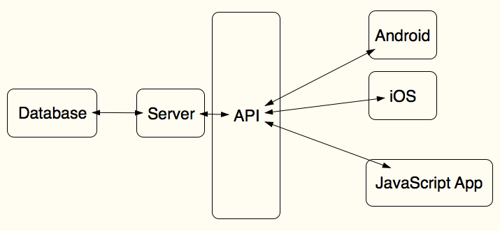
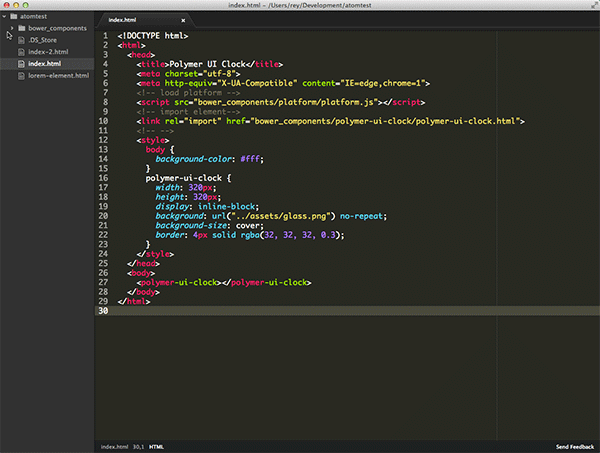

template: cover

# Isomorphic JavaScript

---

# What does that even mean?

---

layout: false

# The short version:

---

# The short version:

---

template: cover

# Background

---

class: center, middle

---

class: center, middle

---
class: center, middle

---

class: center, middle

---

class: center, middle

---

template: cover

# The problem

---

class: center, middle
layout: false

---

class: center, middle

---

template: cover

# The Gray Area

---

class: center, middle

---

template: cover

# A possible solution

---

class: center, middle

---

template: cover

# What's that mean?

---

template: cover
# A JavaScript App can be...

---
class: center, middle

---

class: center, middle

---

class: center, middle

---

template: cover
# It can also be

---

class: center, middle

---

# DOM Production

* The DOM mutates over time
* HTML is a set of instructions on the form and content of the DOM
* It is rendered in the browser with styles dictated by CSS

* Web Developers' concern is also a spectrum
    * data (data models, databases, data transactions)
    * users (experience and interaction)

The story of single page apps is the story of moving pieces of the application across the wire to the browser.

In a SPA, the DOM is mostly produced by JavaScript through:

* templating
* manual DOM creation

---

# One aspect of Isomorphic is replication of this process on the server

* React and Server Side Rendering

---

# Modern app architectures fall into the following module categories

* models
    * persistence
    * (remote persistence)
    * (local persistence)
* views
    * templating
* controllers
* routing

---

# Models

---

# Persistence

* HTTP Requests to Remote APIs
    * SuperAgent
* Storage
    * PouchDB
* Offline-first

---

# Routing

* Director
* React-Router
* rrouter
* react-router-component

---

# Isomorphic Apps are almost all the way at the other end of the complexity spectrum

* Build tools are required
* So are shims (that detect the environment)

Remember fat binaries?

---

# Modules

* Browserify
* Webpack
* ES6
    * SystemJS

---

# Speaking of modules

* node modules are many, and many are good
* use them, many are already isomorphic
    * like lo-dash

---

# Why so serious?

The web is just increasingly complex string concatenation.

At the end of the day, it's just text

Chris Heilmann doesn't think highly of Shimming and polyfills.

You shim like mad in order to make the environment as sane as possible.

The web is the most hostile programming environment known to man.

Build tools shim the programming environment to allow for software engineering

And, you're using a language that was built in 10 days.

Sindre's quote about how spaceships will one day run JavaScript.

That's actually a great metaphor.

(Find this statistic) The surface of this 3rd rock from the sun is just right. For a human to travel beyond this environment, you have to simulate an environment where human life can exist.

---

# The right tool is one that

* you understand how to use effectively today and in 6 months

---

# Just Text

* so, the real trick is, how do we produce the same text on the server (via JavaScript) as we do on the server (also via JavaScript)

---

# And Routing

This is where things get a little weird. (see notes)
The router I chose doesn't work as well for server-side rendering
