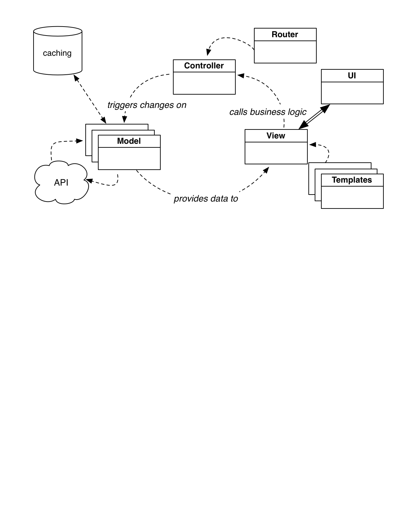
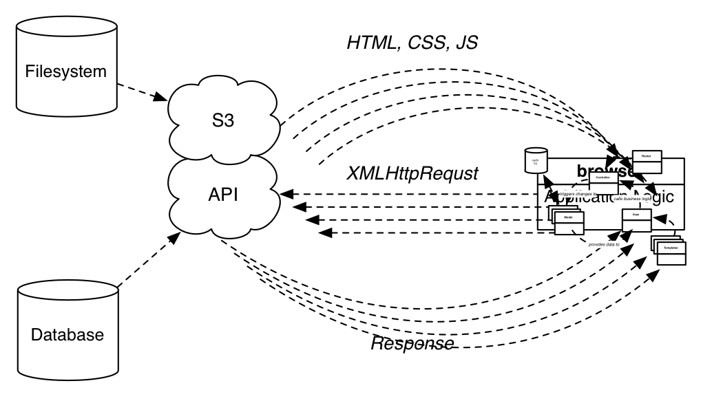

template: cover

# Building Blocks for Isomorphic JavaScript Apps
## Chris Aquino, Big Nerd Ranch

---

class: middle, center
layout: false


---

template: cover

# Front end development has gotten complex.

???

How do we choose among all the tools, frameworks, and libraries?
Of which there are more and more each week.


---

template: cover

# Are we actually doing a better job?

???

(stating the problem) Ultimately, the goal is getting the browser to render a DOM

why am i showing the history?
what problem were we solving (whose by product is all the complexity we're dealing with as developers)

the needs and expectations of the user increased, so we shifted the logic to the browser

* competing with desktop
* then, competing with native apps

* we're providing the user with immersion, cohesion, and integration (partially a time thing. faster access to collaborative data)

---


layout: false

# In the beginning...


???

One file, one page.
Human writes HTML.
Browser renders it.

---

# Database-driven


???

Support dynamic data, without manually creating new pages
Human writes algorithm to write HTML using data from database.
Browser renders it.

---

# Server-side MVC


???

Software engineering practices come to web servers.
Humans create workflows in code form.
Workflows result in HTML.
Browser renders it.


---

# Ajax


???

To increase the "interactivty" on a page, humans employ Ajax.
Whole chunks of HTML are retrieved from server.
Or, XML or JSON data is retrieved from server.

In the case of XML or JSON, the DOM elements are created via JavaScript.
This JavaScript is written either by a human, or is incorporated
into the framework (Rails is writing the JS for the Ajax).

Marks the advent of browser-based thick clients.

---

# Single Page Applications


???
Software engineering practices come to JavaScript.

---

template: cover

# Anatomy of an MVC Application

---

# MV* in the Browser


---

# MV* in the Browser


???

Enter MV*
Which also includes Templating, Routing, and Persistence

JavaScript handles the creation of most, if not all, DOM
using data retrieved from a remote API.

---

# MV* in the Browser


---

# MV* in the Browser


---

# MV* in the Browser


---

# MV* in the Browser


---

# MV* in the Browser



---

# Shifting Responsibility


---

# Shifting Responsibility


---

# Shifting Responsibility


---

# Problem 1: Complexity


???

* js and all assets need to download
* then it has to grab remote data
* takes too long for initial presentation of data

# Partially solved with frameworks

---

# Problem 2: Latency



???

# Partially solved with build tools

---

# Problem 3: Duplicated Efforts


???

# Not really solved

---
template: cover

# (Possible) Solutions

???

## this section needs to be about the isomorphic architecture, with a diagram on the very first slide
## The next slide needs a statement of goals.


How do we go from where we are to where we want to be?
---
# 1: Simplify the mental model

* Frameworks for patterns and conventions

* Build Tools for compiling abstraction languages

---

# 2: Render deep links on the server

* JavaScript on both browser and server

* Render view layer to HTML string

---

# 3: Divide and conquer

* Secondary UI Server handles static rendering

* Aggregates API calls and caches data


???

One of our remaining problems is that the back end knows too much about how our UI is put together.

To solve this problem, we split our concerns further.

We introduce a second server, specifically for aggregating the data for the UI.

But, couldn't we move the template rendering to the second server, also?


---

template: cover

# An Isomorphic Stack

---

# Finding common ground

--

* JavaScript

--

* Node/CommonJS Modules

--

* Context-agnostic Libraries

???

(context agnostic libraries that are needed to fulfill the UI)

---

# Build Tool

* JavaScript-based

* Pipeline-oriented

* Modular

---

# Gulp

```js
var gulp = require('gulp');
var config = require('./config');
var paths = config.paths;

// Actual task functions are in `tasks` folder
var bSync = require('./tasks/sync');
var browserify = require('./tasks/browserify')(paths.js.app, paths.bundleName, paths.js.dest);

gulp.task('build', browserify);
gulp.task('browser-sync', ['build'], bSync.sync(paths.baseDir));

gulp.task('default', ['browser-sync'], function () {
    gulp.watch(paths.js.src, ['build', function () {
        bSync.reload(); // full reload
    }]);
});
```


???

Alternatives: Grunt, Make, Cake, Rake, etc.


## diagram what is the end result of using gulp


Gulp provides a pipeline style task runner with a small API.
Browserify allows you to create and use Node-style modules in your browser-based JavaScript.

Used in combination, you write simple modules, which are bundled into a single JavaScript payload.

---


# Live Reload: BrowserSync

```js
// BrowserSync is a better live-reload + static server
var browserSync = require('browser-sync');

function _sync(dir){
    return function () {
        browserSync({
            open: false,
            server: {
                baseDir: dir,
            }
        });
    };
}

module.exports = {
    sync: _sync,
    reload: browserSync.reload
};
```

???

want to guarantee parity between what is emitted by UI server and what is drawn by the static JS in-browser is the same. so, BS for development testing.

diagram of what i mean by "parity"

A basic `index.html` file will be the base of the application.
BrowserSync will serve it and the bundled JavaScript to the browser, and it
will reload the browser when changes are made to the application code.

---

# Module System

* Context-agnostic

* Minimal Syntax (not require.js)

---

# Browserify

```js
var gulp = require('gulp');
var browserify = require('browserify');
var reactify = require('reactify');
var source = require('vinyl-source-stream');

module.exports = function (src, bundleName, dest) {
    return function () {
        var b = browserify({
            detectGlobals : true
        });
        b.transform(reactify);
        b.add([src]);
        return b.bundle()
            .pipe(source(bundleName))
            .pipe(gulp.dest(dest));
    };
};```


???


Provides Node style Modules as well as some Node APIs for the browser

Alternatives: Webpack

---


# Views: React Components

--

* Declarative

--

* Composable

--

* Performant

---

# Component: Router

```js
/** @jsx React.DOM */
var Router = require('react-router');
var Route = Router.Route;
var Routes = Router.Routes;
var DefaultRoute = Router.DefaultRoute;


var routes = (


);

module.exports = routes;
```

---

# Component: Router

```js
/** @jsx React.DOM */
var Router = require('react-router');
var Route = Router.Route;
var Routes = Router.Routes;
var DefaultRoute = Router.DefaultRoute;
var App = require('./App');
var HelloWorld = require('./components/hello');
var About = require('./components/about');
var Yep = require('./components/yep');
var routes = (


);

module.exports = routes;
```

???

`ReactRouter` was chosen because it is modeled after Ember's robust routing system.
---

# Component: Router

```js
/** @jsx React.DOM */
var Router = require('react-router');
var Route = Router.Route;
var Routes = Router.Routes;
var DefaultRoute = Router.DefaultRoute;
var App = require('./App');
var HelloWorld = require('./components/hello');
var About = require('./components/about');
var Yep = require('./components/yep');
var routes = (
    <Routes location="history" scrollBehavior="browser">
        <Route name="app" path="/" handler={App}>
            <Route name="yep" handler={Yep}></Route>
            <Route name="about" handler={About}></Route>
            <DefaultRoute handler={HelloWorld}></DefaultRoute>
        </Route>
    </Routes>
);

module.exports = routes;
```

???

---
# Component: Router

```js
/** @jsx React.DOM */
var Router = require('react-router');
var Route = Router.Route;
var Routes = Router.Routes;
var DefaultRoute = Router.DefaultRoute;
* var App = require('./App');
var HelloWorld = require('./components/hello');
var About = require('./components/about');
var Yep = require('./components/yep');
var routes = (
    <Routes location="history" scrollBehavior="browser">
*        <Route name="app" path="/" handler={App}>
            <Route name="yep" handler={Yep}></Route>
            <Route name="about" handler={About}></Route>
            <DefaultRoute handler={HelloWorld}></DefaultRoute>
        </Route>
    </Routes>
);

module.exports = routes;
```

???

---

# Component: Router

```js
/** @jsx React.DOM */
var Router = require('react-router');
var Route = Router.Route;
var Routes = Router.Routes;
var DefaultRoute = Router.DefaultRoute;
var App = require('./App');
var HelloWorld = require('./components/hello');
var About = require('./components/about');
var Yep = require('./components/yep');
var routes = (
    <Routes location="history" scrollBehavior="browser">
        <Route name="app" path="/" handler={App}>
*            <Route name="yep" handler={Yep}></Route>
*            <Route name="about" handler={About}></Route>
            <DefaultRoute handler={HelloWorld}></DefaultRoute>
        </Route>
    </Routes>
);

module.exports = routes;
```

???

---

# Component: Router

```js
/** @jsx React.DOM */
var Router = require('react-router');
var Route = Router.Route;
var Routes = Router.Routes;
var DefaultRoute = Router.DefaultRoute;
var App = require('./App');
var HelloWorld = require('./components/hello');
var About = require('./components/about');
var Yep = require('./components/yep');
var routes = (
    <Routes location="history" scrollBehavior="browser">
        <Route name="app" path="/" handler={App}>
            <Route name="yep" handler={Yep}></Route>
            <Route name="about" handler={About}></Route>
*            <DefaultRoute handler={HelloWorld}></DefaultRoute>
        </Route>
    </Routes>
);

module.exports = routes;
```

???

---

# Component: App

```js
/** @jsx React.DOM */
var React = require('react');


var App = React.createClass({
    render: function () {
        return (
            <section>


            </section>
        );
    },


});
module.exports = App;
```

---


# Component: App

```js
/** @jsx React.DOM */
var React = require('react');
*var Header = require('./components/header');
*var Footer = require('./components/footer');
*var HelloWorld = require('./components/hello');
var App = React.createClass({
    render: function () {
        return (
            <section>


            </section>
        );
    },


});
module.exports = App;
```

---

# Component: App

```js
/** @jsx React.DOM */
var React = require('react');
var Header = require('./components/header');
var Footer = require('./components/footer');
var HelloWorld = require('./components/hello');
var App = React.createClass({
    render: function () {
        return (
            <section>
*                <Header />
*                <HelloWorld />
*                <Footer />
            </section>
        );
    },


});
module.exports = App;
```

---


# Component: App

```js
/** @jsx React.DOM */
var React = require('react');
var Header = require('./components/header');
var Footer = require('./components/footer');
var HelloWorld = require('./components/hello');
var App = React.createClass({
    render: function () {
        return (
            <section>
                <Header />
                <HelloWorld />
*                <Footer timeStamp={this._timeStamp()}/>
            </section>
        );
    },
*    _timeStamp: function () {
*        return (new Date()).getTime();
*    }
});
module.exports = App;
```

---

# Component: Footer

```js
/** @jsx React.DOM */
var React = require('react');
var Footer = React.createClass({
    render: function () {
        return (
            <footer>
*                <p>&copy; 2014 @radishmouse: {this.props.timeStamp}</p>
            </footer>
        );
    }
});

module.exports = Footer;
```

---

# Component: Header

```js
/** @jsx React.DOM */
*var Nav = require('./nav');

var React = require('react');
var Header = React.createClass({
    render: function () {
        return (
*            <Nav />
        );
    }
});

module.exports = Header;
```

---

# Component: Nav

```js
/** @jsx React.DOM */
var React = require('react');
var Router = require('react-router');
*var Link = Router.Link;

var Nav = React.createClass({
    render: function () {
        return (
            <nav>
                <ul>
*                   <li><Link to="app">Hello</Link></li>
*                   <li><Link to="yep">Yep</Link></li>
*                   <li><Link to="about">About</Link></li>
                </ul>
            </nav>
        );
    }
});

module.exports = Nav;
```

---

# Component: HelloWorld

```js
/** @jsx React.DOM */
var React = require('react');
var HelloWorld = React.createClass({
    getInitialState: function () {
        return {
            _message: 'Hello, World!'
        };
    },
    render: function () {
        return (
*            <h1 onClick={this._changeMessage}>{this.state._message}</h1>
        );
    },
    _changeMessage: function () {
        return /Hello/.test(this.state._message) ?
            this.setState({_message: 'Goodbye, World!!!'}) :
            this.setState({_message: 'Hello, World!'});
    }
});
module.exports = HelloWorld;
```

???

why react?
b/c it fulfills the DOM production aspect, regardless of context.

(maybe on an earlier slide, i can make it more explicit what my goals are for isomorphic)

Use React components for the View layer.

* functions
* composable
* context-agnostic
* can emit HTML strings


---


# Static Version

```html
<!doctype html>
<html>
    <head>
        <meta charset="utf-8">
        <title>isomorphic demo</title>
        <meta name="viewport" content="width=device-width, initial-scale=1">
        <link rel="stylesheet" href="stylesheets/application.css">
    </head>
    <body>
        <script src="scripts/bundle.js"></script>
    </body>
</html>
```


---

# Server-Side Rendering: React Component

```js
var express = require('express');
var webapp = express();
var path = require('path');
var React = require('react');
require('node-jsx').install(); // Compile JSX on the fly
*var App = require('../src/app');

webapp.get('*', function (req, res) {
    var htmlString = '<!doctype html><html><head></head><body>';
*    htmlString += React.renderComponentToString(App());
    htmlString += '<script src="scripts/bundle.js"></script>';
    htmlString += '</body></html>';
    res.send(htmlString);
});

var PORT = 1337;
webapp.listen(PORT);
console.log('Listening on ' + PORT);
```


???

Routing is duplicated on the server using our custom `ReactRouter` component.
We could not it render on the server the way that regular React components are rendered to HTML.

---
# Server-Side Rendering: React Router

```js
var express = require('express');
var webapp = express();
var path = require('path');
var React = require('react');
require('node-jsx').install(); // Compile JSX on the fly
var Router = require('react-router');
*var AppRoutes = require('../src/routes');

webapp.get('*', function (req, res) {
*    Router.renderRoutesToString(AppRoutes, req.path, function (err, reason, string) {
        var htmlString = '<!doctype html><html><head></head><body>';
*        htmlString += string;
        htmlString += '<script src="scripts/bundle.js"></script>';
        htmlString += '</body></html>';
        res.send(htmlString);
    });
});

var PORT = 1337;
webapp.listen(PORT);
console.log('Listening on ' + PORT);
```

???


The Express application can compile the components as needed.
The components are rendered to an their HTML representation.


---


# Models and Controllers: Flux

* Store

* Dispatcher

* Actions

???

Flux Stores are used instead of a traditional (mutative) Model layer (such as Backbone.Model).

Dispatchers and Actions replace controllers.

???

# Rendering Components with initial data (aside)

On the server, we inject the initial data for the stores via a global variable.

---

# Isomorphic Library: SuperAgent

Take one of our Stores, and wire it up with SuperAgent

The server doesn't actually need to .post anything, just .get stuff from
the remote server

bonus: add caching

we are highlighting the use of an isomorphic library, superagent

Retrieve the data from the remote host from either the server or the client.

If appropriate, cache the data per screen on the server-side.

---

template: cover

# Wins

---

# Focused Development Energy

--

* Single JavaScript codebase

--

* API developers no longer concerned with UI


---

# React + Flux

--

* Simple patterns that scale

--

* Side-steps issues with data-binding

--

* Simple server-side rendering of deep links

???

* What is the payoff after using this complicated setup?
    * The React/Flux stack was designed with scaling development by simplifying the mental model
        * The conventions of your stack are data-flow centric, not object-mutation centric
        * (If you think about an organization, you're focused on what people do, and not what they're called)
    * Likewise, you allow your developers to play to their strengths
        * Back end can build out APIs
        * Front end can focus on performant UIs
            * Per-screen API calls can be aggregated and cached on the Node server
            * Component-based styling lends itself to styleguide driven development

---

# Affordances for Designers and UI Engineers

--

* Components allow for atomic design

--

* JSX is familiar

--

* Synchronized device testing

--

* Components usable for styleguide-driven development

???

* Implications on design
    * the JSX in /src/components lends itself to atomic design
    * after the stack is installed (via `npm install`, BrowserSync provides a way to test your design on multiple devices simultaneously
        * you could use fixture data
        * and one could add automated screenshots
    * you could create prototypes relatively quickly by:
        * serving stubbed out .json files from `/api-static`
        * using lo-fi CSS coupled with pre-built standard components
            * (similar to react-bootstrap)
* How easy is it to do TDD with this style of development? (That is, won't you have to test everything twice to make sure that the server-side rendering and browser rendering of components is the same?)
    * Testing the changes that occur during user interaction is the same.
    * Testing load of deep linking is what needs to be duplicated
    * Otherwise, there are tools (yes, from Facebook) that work well with React/Flux based stack
        * Jest for unit tests
        * [Huxley](https://github.com/facebook/huxley) for visual regression


---

# User sees stuff, sooner

--

* HTML pre-rendered with data

--

* Lower latency from UI server caching

--

* Reduced rendering overhead

---

template: cover
# Tradeoffs

---

# Not an established ecosystem

--

* Some assembly required

--

* Smaller community

--

* No training or books

---

# Not an established ecosystem, but...

--

* Examples exist: [bit.ly/isojs-demo](bit.ly/isojs-demo)

* Setup is `npm install && gulp`


--

* Community is combination of Node.js and Front End developers

--

* Big Nerd Ranch offers training for Cross-Platform JavaScript Apps


???

(break up)

* And what are the tradeoffs?
    * It's not an already established ecosystem (outside of places like Facebook or AirBnB) like Embularbone
        * You can't just it up and build an app with a dozen lines of configuration
        * But, at the same time, there is no magic, no mystery about the way it works.
            * The ecosystem is largey npm
    * Getting the stack set up is tricky
        * There are a few sample projects on github
            * including this one
    * Training? Books?
        * Big Nerd Ranch's Cross-Platform JavaScript Apps course is available, with Isomorphic techniques


---

template: cover

# Thank you for listening!


## @radishmouse, @bignerdranch

