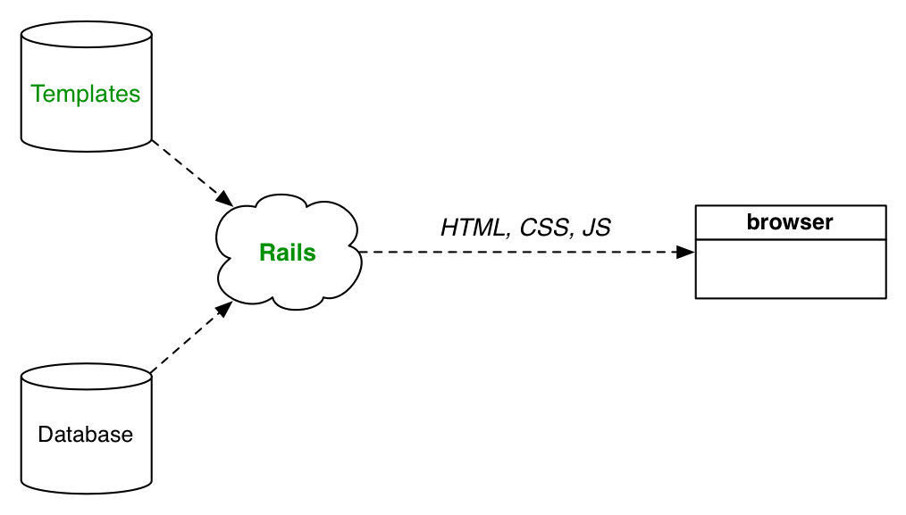
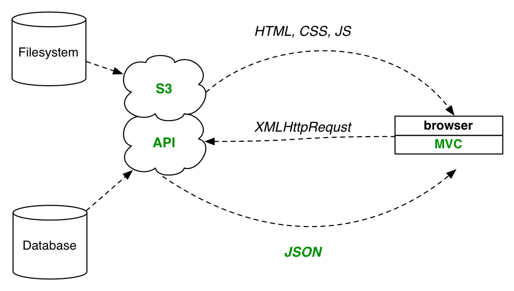
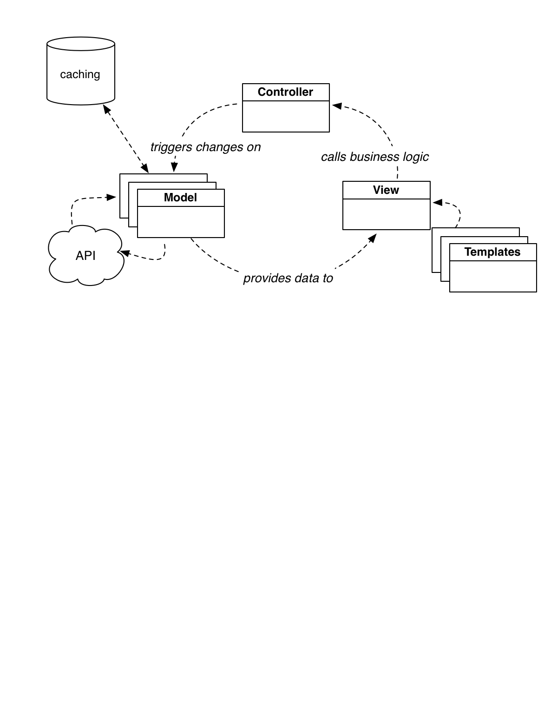
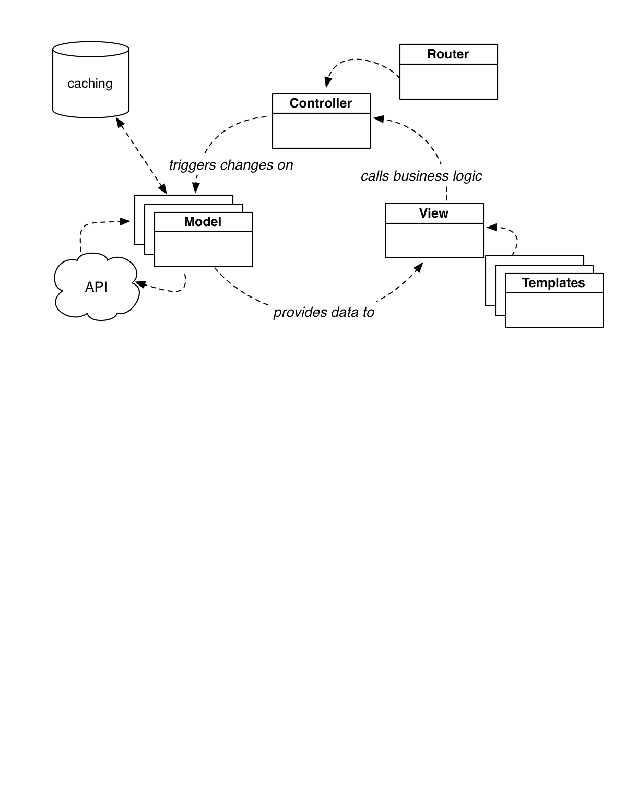

template: cover

# Building Blocks for Isomorphic JavaScript Apps
## Chris Aquino, Big Nerd Ranch

???

excited

first connect-js

---

class: middle, center
layout: false


???

big nerd ranch

training

app development

director of front end web

favorite part of job...


---
# Arbitrarily ridiculous photo of me


???

is playing ping pong

my second favorite

researching techniques

make my team more effective

when I'm doing research...

---

template: cover

# Front end development has gotten complex.

???

realize stuff has gotten complicated

and it's only getting more complicated

before I contribute to that

let's take a step back and ask...


---

template: cover

# Are we actually doing a better job?

???


I don't know.

Let's take a look.


---


layout: false

# In the beginning...


???

One file, one page.

Human writes HTML.

Browser renders it to a DOM.

---

# Database-driven


???

Dynamic data

write code

mashes it up with HTML

send it down the wire

Browser renders it to a DOM.

---

# Server-side MVC



???

Next version

software engineering best practices

come to web development

processes and workflows

result in HTML

Browser renders it to a DOM.


---

# Ajax


???

2005

Designer: Jesse James Garret

technique to increase increase interactivity

fewer page reloads

more dynamic pages

Server delivers some HTML

Browser renders it to DOM

JavaScript modifies that DOM in some way.

---

# Single Page Applications



???

Google and Yahoo turn Ajax up to 11

Apps like Gmail are created.

Then, the rest of us start doing it.

How?


---

template: cover

# Anatomy of an MVC Application

???

For those of you who don't know

MVC is a design pattern

created by Alan Kay in the 70s

used in iOS applications

Rails made it popular with web devs

and we brought various forms to the browser

In general...

---

# MV* in the Browser


???

Three basic conceptual pieces

Models - source of truth

Views - draw UI and handle UI events

Controllers - house business logic

---

# MV* in the Browser


???

Here's how they relate.

Virtuous cycle

But, that's not the whole picture


---

# MV* in the Browser


???

You want reusable templates that your views can render

---

# MV* in the Browser


???

And, your models may talk to an API for data

---

# MV* in the Browser



???

Oh, and you probably want to cache some of that data locally

---

# MV* in the Browser



???

Finally, all of that stuff will need to be

swapped out

or nested

for internal navigation

But...what was the point of all of this again?...

---

# MV* in the Browser


???

Oh yeah!

To render a DOM.

---

template: cover

# mvcwtf

???

what have we done?

---

# Shifting Responsibility


???

Started with a simple model

---

# Shifting Responsibility


???

Then took an increasingly complicated pattern

---

# Shifting Responsibility


???

And moved it

to a platform

originally designed to show text

And...

---

# Thick clients, slow startup


???

js and all assets need to download

then it has to grab remote data

takes too long for initial presentation of data

Then, back end...

---

# Back end vs. UI

## Many requests

```js
$.get('/api/users', function (data) { /* ... */});
$.get('/api/events', function (data) { /* ... */});
$.get('/api/groups', function (data) { /* ... */});
$.get('/api/puppies', function (data) { /* ... */});
```

## Or vague endpoints

```js
$.get('/api/all-the-things-for-dashboard', function (data) { /* ... */});
```

???


Do you make many requests?

Or do you have your back end devs write code that is specific to your UI

What about iOS or Android clients with different UI?


---
template: cover

# A (Possible) Solution

???

Where do we go from here?


---

# Isomorphic JavaScript Application Architecture


???

You add a UI server

can render any screen, any route statically

delivers HTML straight to the browser

and it can cache data from APIs


---

# bit.ly/isojs-demo


???

I've put together a demo project.

Definition of "trivial" application

But, it demonstrates each piece of the stack.

And I'm going to walk you through it now.


---

# "Isomorphic" JavaScript

--

* A single JavaScript application

--

* Runs in browser or Node.js

--

* Render views to static HTML from Node.js


???

Code that produces a DOM (or HTML) can run from client or server

Also, any code that helps produce the DOM (populating it with data)

can run from client or server.

In order to make that work, you need...

---

# Building and development


---

# Gulp

```js
var gulp = require('gulp');
var config = require('./config');
var paths = config.paths;

// Actual task functions are in `tasks` folder
var bSync = require('./tasks/sync');
var browserify = require('./tasks/browserify')(paths.js.app, paths.bundleName, paths.js.dest);

gulp.task('build', browserify);
gulp.task('browser-sync', ['build'], bSync.sync(paths.baseDir));

gulp.task('default', ['browser-sync'], function () {
    gulp.watch(paths.js.src, ['build', function () {
        bSync.reload(); // full reload
    }]);
});
```


???

Alternatives: Grunt, Make, Cake, Rake, etc.


## diagram what is the end result of using gulp


Gulp provides a pipeline style task runner with a small API.


---

# Browserify

```js
var gulp = require('gulp');
var browserify = require('browserify');
var reactify = require('reactify');
var source = require('vinyl-source-stream');

module.exports = function (src, bundleName, dest) {
    return function () {
        var b = browserify({
            detectGlobals : true
        });
        b.transform(reactify);
        b.add([src]);
        return b.bundle()
            .pipe(source(bundleName))
            .pipe(gulp.dest(dest));
    };
};```


???


Provides Node style Modules as well as some Node APIs for the browser

Alternatives: Webpack


---

template: cover


---

# "A Javascript Library For Building User Interfaces"

--

* V in MVC

--

* Virtual DOM

--

* Data Flow

--

* Views can rendered to HTML strings

---
# MVC with React


???

React will take the place of both our View layer

and our Templates

???


To give you an idea of what a component looks like, here's one...
---

# "Hello World" Module

```js
/** @jsx React.DOM */
var React = require('react');
var HelloWorld = React.createClass({
    render: function () {


    }
});
module.exports = HelloWorld;
```

---

# "Hello World" Module

```js
/** @jsx React.DOM */
var React = require('react');
var HelloWorld = React.createClass({
    render: function () {
        return (


        );
    }
});
module.exports = HelloWorld;
```

---


# "Hello World" Module

```js
/** @jsx React.DOM */
var React = require('react');
var HelloWorld = React.createClass({
    render: function () {
        return (
            <div>
                <h1>Hello, Connect-JS!</h1>
            </div>
        );
    }
});
module.exports = HelloWorld;
```

???

That's not HTML.

It's JSX.

That gets transformed in our build step

They're really just functions


---
template: cover

# Example App: Views

---

# View Component Structure


---

# View Component: App

```js
/** @jsx React.DOM */
var React = require('react');


var App = React.createClass({
    render: function () {
        return (
            <section>


            </section>
        );
    },


});
module.exports = App;
```

---


# View Component: App

```js
/** @jsx React.DOM */
var React = require('react');
*var Header = require('./components/header');
*var Footer = require('./components/footer');
*var HelloWorld = require('./components/hello');
var App = React.createClass({
    render: function () {
        return (
            <section>


            </section>
        );
    },


});
module.exports = App;
```

---

# View Component: App

```js
/** @jsx React.DOM */
var React = require('react');
var Header = require('./components/header');
var Footer = require('./components/footer');
var HelloWorld = require('./components/hello');
var App = React.createClass({
    render: function () {
        return (
            <section>
*                <Header />
*                <HelloWorld />
*                <Footer />
            </section>
        );
    },


});
module.exports = App;
```

---

template: cover

# Example App: Routing

---

# Routing with React


???

We want to use React for Routing

3 reasons

First, we need for the router to load deeply nested routes

Second, the router can render the nested route to HTML

Third, we want to reuse the routing code in the browser and the server

---

# Routing with React


???

So, as we load other components in place of HelloWorld

The router can load those other components based on the route

While still keeping it nested inside the App component

alongside the header and footer components

---

# Component: Router

```js
/** @jsx React.DOM */
var Router = require('react-router');
var Route = Router.Route;
var Routes = Router.Routes;
var DefaultRoute = Router.DefaultRoute;


var routes = (


);

module.exports = routes;
```

???

Here's how you write the router module

import the library code


---

# Component: Router

```js
/** @jsx React.DOM */
var Router = require('react-router');
var Route = Router.Route;
var Routes = Router.Routes;
var DefaultRoute = Router.DefaultRoute;
var App = require('./App');
var HelloWorld = require('./components/hello');
var About = require('./components/about');
var Yep = require('./components/yep');
var routes = (


);

module.exports = routes;
```

???

Then, import your App and the components that you can route between

---

# Component: Router

```js
/** @jsx React.DOM */
var Router = require('react-router');
var Route = Router.Route;
var Routes = Router.Routes;
var DefaultRoute = Router.DefaultRoute;
var App = require('./App');
var HelloWorld = require('./components/hello');
var About = require('./components/about');
var Yep = require('./components/yep');
var routes = (
    <Routes location="history" scrollBehavior="browser">
        <Route name="app" path="/" handler={App}>
            <Route name="yep" handler={Yep}></Route>
            <Route name="about" handler={About}></Route>
            <DefaultRoute handler={HelloWorld}></DefaultRoute>
        </Route>
    </Routes>
);

module.exports = routes;
```

???

Name your routes

and specify what components handle each route

---
# Component: Router

```js
/** @jsx React.DOM */
var Router = require('react-router');
var Route = Router.Route;
var Routes = Router.Routes;
var DefaultRoute = Router.DefaultRoute;
* var App = require('./App');
var HelloWorld = require('./components/hello');
var About = require('./components/about');
var Yep = require('./components/yep');
var routes = (
    <Routes location="history" scrollBehavior="browser">
*        <Route name="app" path="/" handler={App}>
            <Route name="yep" handler={Yep}></Route>
            <Route name="about" handler={About}></Route>
            <DefaultRoute handler={HelloWorld}></DefaultRoute>
        </Route>
    </Routes>
);

module.exports = routes;
```

???

Notice that the App is the top level route

It is situated at the root "/"

---

# Component: Router

```js
/** @jsx React.DOM */
var Router = require('react-router');
var Route = Router.Route;
var Routes = Router.Routes;
var DefaultRoute = Router.DefaultRoute;
var App = require('./App');
var HelloWorld = require('./components/hello');
var About = require('./components/about');
var Yep = require('./components/yep');
var routes = (
    <Routes location="history" scrollBehavior="browser">
        <Route name="app" path="/" handler={App}>
*            <Route name="yep" handler={Yep}></Route>
*            <Route name="about" handler={About}></Route>
            <DefaultRoute handler={HelloWorld}></DefaultRoute>
        </Route>
    </Routes>
);

module.exports = routes;
```

???

The other components are sub-routes

---

# Component: Router

```js
/** @jsx React.DOM */
var Router = require('react-router');
var Route = Router.Route;
var Routes = Router.Routes;
var DefaultRoute = Router.DefaultRoute;
var App = require('./App');
var HelloWorld = require('./components/hello');
var About = require('./components/about');
var Yep = require('./components/yep');
var routes = (
    <Routes location="history" scrollBehavior="browser">
        <Route name="app" path="/" handler={App}>
            <Route name="yep" handler={Yep}></Route>
            <Route name="about" handler={About}></Route>
*            <DefaultRoute handler={HelloWorld}></DefaultRoute>
        </Route>
    </Routes>
);

module.exports = routes;
```

???

And, you can define a default


---

template: cover
# Server-Side Rendering

---

# Rendering for a route

```js
var express = require('express');
var webapp = express();
var path = require('path');
var React = require('react');
require('node-jsx').install(); // Compile JSX on the fly


webapp.get('*', function (req, res) {


});

var PORT = 1337;
webapp.listen(PORT);
console.log('Listening on ' + PORT);
```


---
# Rendering for a route

```js
var express = require('express');
var webapp = express();
var path = require('path');
var React = require('react');
require('node-jsx').install(); // Compile JSX on the fly
*var Router = require('react-router');
*var AppRoutes = require('../src/routes');

webapp.get('*', function (req, res) {
*    Router.renderRoutesToString(AppRoutes, req.path, function (err, reason, string) {


    });
});

var PORT = 1337;
webapp.listen(PORT);
console.log('Listening on ' + PORT);
```


---
# Rendering for a route

```js
var express = require('express');
var webapp = express();
var path = require('path');
var React = require('react');
require('node-jsx').install(); // Compile JSX on the fly
var Router = require('react-router');
var AppRoutes = require('../src/routes');

webapp.get('*', function (req, res) {
    Router.renderRoutesToString(AppRoutes, req.path, function (err, reason, string) {
        var htmlString = '<!doctype html><html><head></head><body>';
*        htmlString += string;
        htmlString += '<script src="scripts/bundle.js"></script>';
        htmlString += '</body></html>';
        res.send(htmlString);
    });
});

var PORT = 1337;
webapp.listen(PORT);
console.log('Listening on ' + PORT);
```


---

template: cover

# Models and Controllers

???

---

# React all the things


---

# But...

--


???

Instead of traditional MVC

You have a one-way data flow through the app

Stores instead of Models

Other Views instead of Controllers

Actions wrap all data from ui events or server events

Dispatcher manages all Actions


---

# Flux Architecture: Dipatcher

```js
var Dispatcher = require('flux').Dispatcher;
var copyProperties = require('react/lib/copyProperties');
var AppDispatcher = copyProperties(new Dispatcher(), {

*    handleServerAction: function(action) {
        /* ... */
    }
    ...
});

module.exports = AppDispatcher;
```


???

You defined custom handlers on the Dispatcher

---

# Flux Architecture: Actions

```js
var AppDispatcher = require('../dispatcher/AppDispatcher');

module.exports = {
    receiveAll: function(rawData) {

*        AppDispatcher.handleServerAction({
            type: "RECEIVE_DATA",
            rawData: rawData
        });

    }
};
```

???

You call your custom handlers from Actions

and send them any data


---

# Flux Architecture: Stores

```js
var AppDispatcher = require('../dispatcher/AppDispatcher');
...
var Store = merge(EventEmitter.prototype, {
    /* ... */
});
*Store.dispatchToken = AppDispatcher.register(function(payload) {
    _data = payload.action.rawData;
    Store.emitChange();
});
module.exports = Store;
```

???

Stores, instead of models

register to receive data from actions


---

#Flux Architecture: Views Subscribing to Stores

```js
...
var HelloWorld = React.createClass({

    componentDidMount: function() {
*      Store.addChangeListener(this._onChange);
    },

    render: function () {...},

*    _onChange: function () {
        /* ... */
    }
});

module.exports = HelloWorld;

```

---

# One way data flow


---

template: cover

# Isomorphic Libraries

---

# SuperAgent

```js
var ActionCreator = require('../actions/ActionCreator');
var request = require('superagent');
var URL = 'http://my.remote.server/endpoint';

var _data = [];
module.exports = {

    getAllNodes: function() {


*        request.get(URL, function (res){
            _data = res.body;
            ActionCreator.receiveAll(_data);
        });
    }
};
```

???

Example of an isomorphic library

API is the same whether on browser or Node.js

Library detects its environment and does the right thing

---

# Isomorphic Library: SuperAgent

```js
var ActionCreator = require('../actions/ActionCreator');
var request = require('superagent');
var URL = 'http://my.remote.server/endpoint';

var _data = [];
module.exports = {

    getAllNodes: function() {

        // fake caching via intermediary variable
*        ActionCreator.receiveAll(_data);

        request.get(URL, function (res){
            _data = res.body;
            ActionCreator.receiveAll(_data);
        });
    }
};
```


???

bonus: add caching

when the data is requested, we send out what we already have

once the request comes back, we send out the new data

If appropriate, cache the data per screen on the server-side.

---

template: cover

# Wins

---

# Focused Development Energy

--

* Single JavaScript codebase

--

* API developers no longer concerned with UI


---

# React + Flux

--

* Simple patterns that scale

--

* Side-steps issues with data-binding

--

* Simple server-side rendering of deep links

???

* What is the payoff after using this complicated setup?
    * The React/Flux stack was designed with scaling development by simplifying the mental model
        * The conventions of your stack are data-flow centric, not object-mutation centric
        * (If you think about an organization, you're focused on what people do, and not what they're called)
    * Likewise, you allow your developers to play to their strengths
        * Back end can build out APIs
        * Front end can focus on performant UIs
            * Per-screen API calls can be aggregated and cached on the Node server
            * Component-based styling lends itself to styleguide driven development

---

# Affordances for Designers and UI Engineers

--

* Components allow for atomic design

--

* JSX is familiar

--

* Components usable for styleguide-driven development

???


---

# User sees stuff, sooner

--

* HTML pre-rendered with data

--

* Reduced rendering overhead

---

template: cover
# Tradeoffs

---

# Not an established ecosystem

--

* Some assembly required

--

* Smaller community

--

* No training or books

---

# Not an established ecosystem, but...

--

* Examples exist: [bit.ly/isojs-demo](bit.ly/isojs-demo)

* Setup is `npm install && gulp`


--

* Community is combination of Node.js and Front End developers

--

* Big Nerd Ranch offers training for Cross-Platform JavaScript Apps


???

(break up)

I'll be adding on to my example code, you can fork or send pull requests

Community also includes folks at Yahoo, Facebook, and AirBnB who are already doing isomorphic apps

You can always ping me if you want to talk about JavaScript.

I'm planning on incorporating some of these techniques into the BNR class

---

template: cover

# Thank you for listening!


## @radishmouse, @bignerdranch

