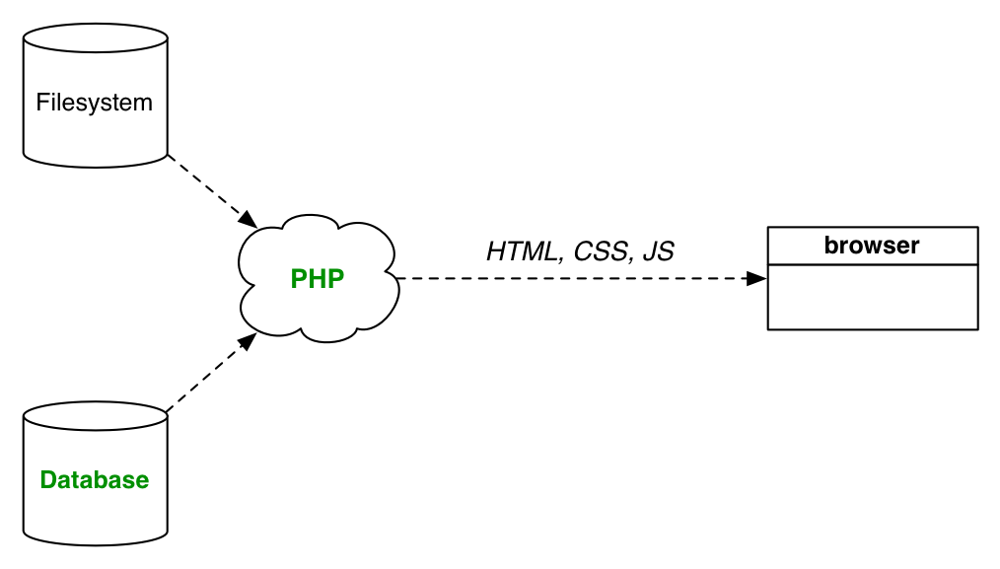
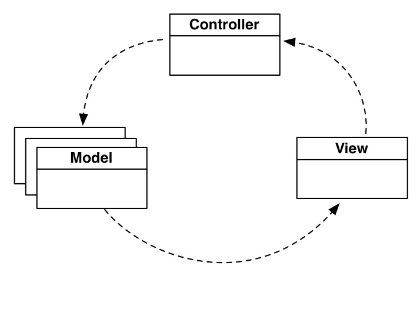

template: cover

# Building Blocks for Isomorphic JavaScript Apps
## Chris Aquino, Big Nerd Ranch

---

class: middle, center
layout: false

---

template: cover

# From Static to Single Page Application

---

layout: false

# In the beginning...

???

One file, one page.
Human writes HTML.
Browser renders it.

---

# Database-driven

???

Support dynamic data, without manually creating new pages
Human writes algorithm to write HTML using data from database.
Browser renders it.

---

# Server-side MVC

???

Software engineering practices come to web servers.
Humans create workflows in code form.
Workflows result in HTML.
Browser renders it.

---

# Ajax

???

To increase the "interactivty" on a page, humans employ Ajax.
Whole chunks of HTML are retrieved from server.
Or, XML or JSON data is retrieved from server.

In the case of XML or JSON, the DOM elements are created via JavaScript.
This JavaScript is written either by a human, or is incorporated
into the framework (Rails is writing the JS for the Ajax).

Marks the advent of browser-based thick clients.

---

# Single Page Applications

???
Software engineering practices come to JavaScript.

---

# Browser MV*

???

Enter MV*
Which also includes Templating, Routing, and Persistence

JavaScript handles the creation of most, if not all, DOM
using data retrieved from a remote API.

---

# Browser MV*

---

# Browser MV*

---

# Browser MV*

---

# Browser MV*

---

# Frameworks are ecosystems

--

* Abstractions

--

* Conventions

--

* Community

???

To wrangle the complexity, we add more layers of abstraction and standardize the conventions, which increases the overall complexity, but reduces the amount of complexity for the day-to-day work of a developer

solve some of the problems, but not all

---

# Build Tools

--

* Manage dependencies

--

* Optimize assets

--

* Transpile and/or Precompile

???

---

# The Back End problem

The front end now replicates the kind of DOM production formerly done by back end frameworks.

They can now move towards APIs.

But, the APIs should not need to know about what's on a screen.

By the same token, we should not weigh down the client with too many API requests to assemble the data needed for any single screen.

---

template: cover

# Going Isomorphic

---

# Sharing is caring

Earlier versions of this was the sharing of templates with your backend.
The goal was to reduce the time before the user could see the UI and then interact with it.

That solves one of the problems.

---

# Divide and conquer

To solve this problem, we split our concerns further.
We introduce a second server, specifically for aggregating the data for the UI.

But, couldn't we move the template rendering to the second server, also?

---

# Common ground

(that last transition is messy and unclear)
To do that, we should choose a common

* language
* module system
* set of libraries (context agnostic libraries that are needed to fulfill the UI)

---

# Shimmed context

(move this slide)
you're essentially shimming the environment that your app runs in.

and really, you're shimming the environment in which DOM is produced, which overlaps to the development environment
---

# Shims and Polyfills

anti-psychotics for your code

---

# Build tool

we were already using a build tool for building modern SPAs

---

# DOM production

so, we can reuse a subset of these build steps, but on the UI server

---

template: cover

# The Stack

---

# Base setup

---

## Build Tool

Gulp provides a pipeline style task runner with a small API.
Browserify allows you to create and use Node-style modules in your browser-based JavaScript.

Used in combination, you write simple modules, which are bundled into a single JavaScript payload.

---

## BrowserSync

A basic `index.html` file will be the base of the application.
BrowserSync will serve it and the bundled JavaScript to the browser, and it
will reload the browser when changes are made to the application code.

---

# Component based application

---

# Routing

`ReactRouter` was chosen because it is modeled after Ember's robust routing system.

---

# Server-Side Rendering

The Express application can compile the components as needed.
The components are rendered to an their HTML representation.

---

# Rendering the Router component

Routing is duplicated on the server using our custom `ReactRouter` component.
We could not it render on the server the way that regular React components are rendered to HTML.

---

# Models and Controllers

Flux Stores are used instead of a traditional (mutative) Model layer (such as Backbone.Model).

Dispatchers and Actions replace controllers.

---

# Rendering Components with initial data

On the server, we inject the initial data for the stores via a global variable.

---

# HTTP/XHR

---

template: cover

# And...so:

---

# Winning

(break this into multiple slides)

* What is the payoff after using this complicated setup?
    * The React/Flux stack was designed with scaling development by simplifying the mental model
        * The conventions of your stack are data-flow centric, not object-mutation centric
        * (If you think about an organization, you're focused on what people do, and not what they're called)
    * Likewise, you allow your developers to play to their strengths
        * Back end can build out APIs
        * Front end can focus on performant UIs
            * Per-screen API calls can be aggregated and cached on the Node server
            * Component-based styling lends itself to styleguide driven development

* Implications on design
    * the JSX in /src/components lends itself to atomic design
    * after the stack is installed (via `npm install`, BrowserSync provides a way to test your design on multiple devices simultaneously
        * you could use fixture data
        * and one could add automated screenshots
    * you could create prototypes relatively quickly by:
        * serving stubbed out .json files from `/api-static`
        * using lo-fi CSS coupled with pre-built standard components
            * (similar to react-bootstrap)
* How easy is it to do TDD with this style of development? (That is, won't you have to test everything twice to make sure that the server-side rendering and browser rendering of components is the same?)
    * Testing the changes that occur during user interaction is the same.
    * Testing load of deep linking is what needs to be duplicated
    * Otherwise, there are tools (yes, from Facebook) that work well with React/Flux based stack
        * Jest for unit tests
        * [Huxley](https://github.com/facebook/huxley) for visual regression

---

# Still climbing

(break up)

* And what are the tradeoffs?
    * It's not an already established ecosystem (outside of places like Facebook or AirBnB) like Embularbone
        * You can't just it up and build an app with a dozen lines of configuration
        * But, at the same time, there is no magic, no mystery about the way it works.
            * The ecosystem is largey npm
    * Getting the stack set up is tricky
        * There are a few sample projects on github
            * including this one
    * Training? Books?
        * Big Nerd Ranch's Cross-Platform JavaScript Apps course is available, with Isomorphic techniques

---

template: cover

# Thank you!

## @radishmouse, @bignerdranch

