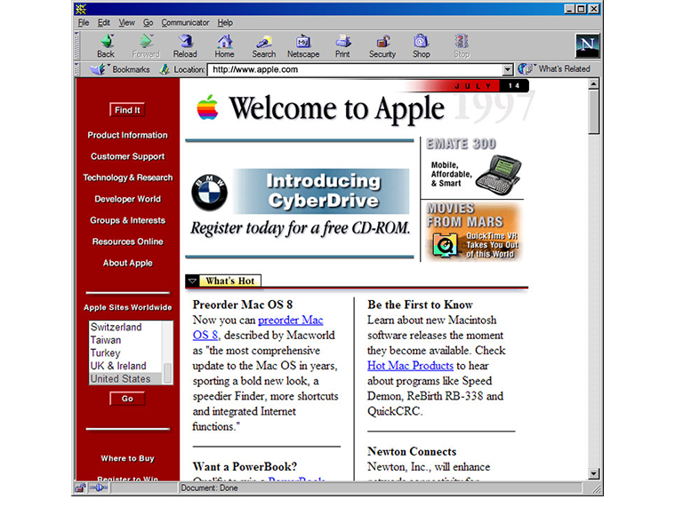
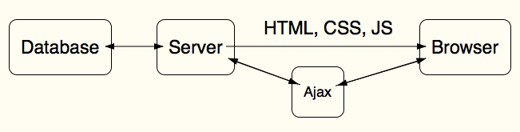
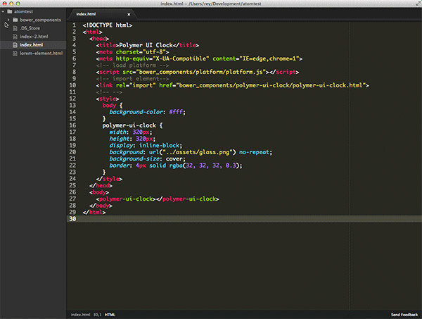

template: cover

# Isomorphic JavaScript

---

# What does that even mean?

---

layout: false

# The short version:

---

# The short version:

---

template: cover

# Background

---

class: center, middle

---

class: center, middle

---
class: center, middle

---

class: center, middle

---

class: center, middle

---

template: cover

# The problem

---

class: center, middle
layout: false

---

class: center, middle

---

template: cover

# The Gray Area

---

class: center, middle

---

template: cover

# A possible solution

---

class: center, middle

---

template: cover

# What's that mean?

---

template: cover
# A JavaScript App can be...

---
class: center, middle

---

class: center, middle

---

class: center, middle

---

template: cover
# It can also be

---

class: center, middle

